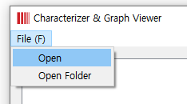
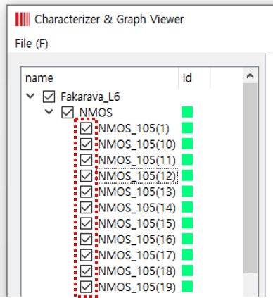
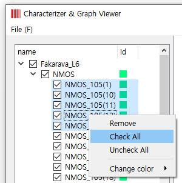
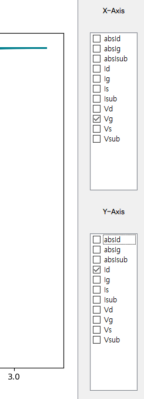
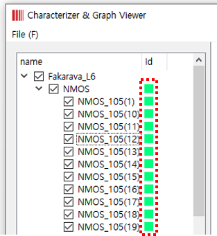
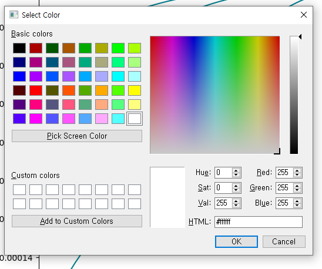
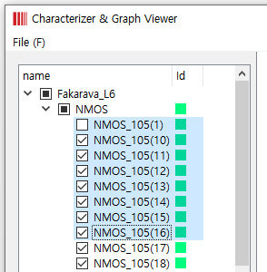
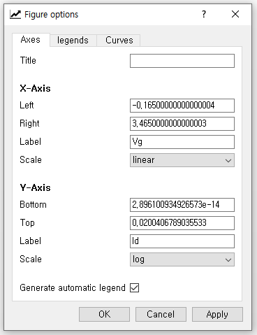
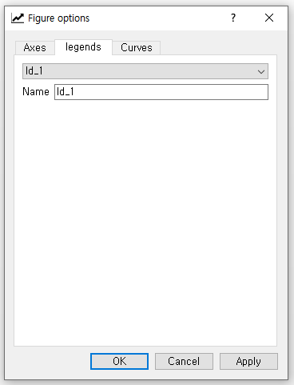
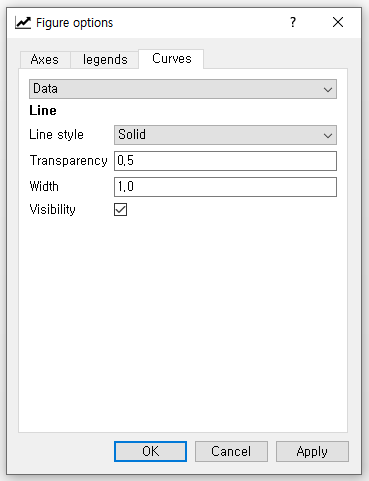

# CGV User Manual

## 1. Open File/Folder

####     1.1. In the menu bar, click the "Open" or "Open Folder" tab.

####     1.2. Choose the file you want.

## 2. Draw the Graph

####     2.1.1. Click the check box in the tree view.

####     2.1.2. Click the mouse right click on the selected items and select "Check All" tab.

####     2.2. Select the coordinate axis you want to draw.

## 3. Change the color of the graph

####     3.1.1. Click the color box on the tree view.

####     3.1.2. Click the mouse right click on the selected items and select "change color" tab.

####     3.2. Click the color you want in the color dialog.

## 4. Remove items

####     4.1. Select the file you wants. You can select it all at once using the shift button.

####     4.2. Click the mouse right click on the selected items and select "Remove" tab.

## 5. Using the navigation toolbar

####     5.1. Home, Forward and Back button

    These are akin to a web browser's home, forward and back button. Forward and back are used to navigate back and forth between previously moved/zoomed view

####     5.2. Pan/Zoom button

    This button has two modes: pan and zoom. Click the toolbar button to activate panning and zooming, then put your mouse somewhere over an axes.

* Press the left mouse button and hold it to pan the figure, dragging it to a new position. When you release it, the data under the point where you pressed will be moved to the point where you released.
* Press the right mouse button to zoom, dragging it to a new position. The x axis will be zoomed in proportionately to the rightward movement and zoomed out proportionately to the leftward movement. The same is true for the y axis and up/down motions. 

####     5.3. Zoom button

    Click this toolbar button to activate this mode. Put your mouse somewhere over an axes and press a mouse button. Define a rectangular region by dragging the mouse while holding the button to a new location. 

* When using the left mouse button, the axes view limits will be zoomed to the defined region.
* When using the right mouse button, the axes view limits will be zoomed out, placing the original axes in the defined region.

####     5.3. Figure options button

        Click this button to adjust the axis options or legend or other.

####     5.3.1 Axes tab

####        

| Name | **description** |
| :--- | :--- |
| **Title** | Edit the title of the graph |
| **Left-Right/Bottom-Top** | Edit the displayed range of  axis |
| **Label** | Edit the label of the  axis |
| **Scale** | Edit the scale of the axis |
| **Generate legend** | If checked, show the Legend |

####      5.3.1 Legends tab

| Name | Description |
| :--- | :--- |
| Name | Edit each entry in the legend |

####     5.3.1 Curves tab

| Name | Description |
| :--- | :--- |
| **Data Name** | Select the category to modify line options \(Data, Average, Standard deviation\) |
| **Line Style** | Select the line style |
| **Transparency** | Edit the transparency of line |
| **Width** | Edit the line width |
| **Visibility** | Set the line’s visibility |

####     5.3. Save button

    Click this button to launch a file save dialog. You can save files with the following extensions: png, ps, eps, svg and pdf.

