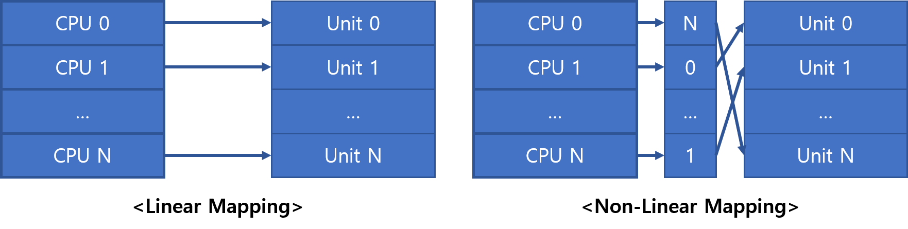
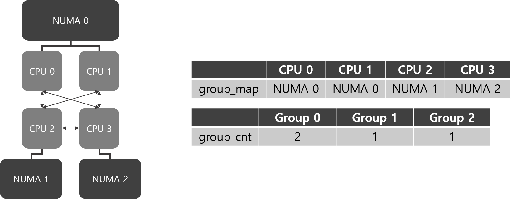
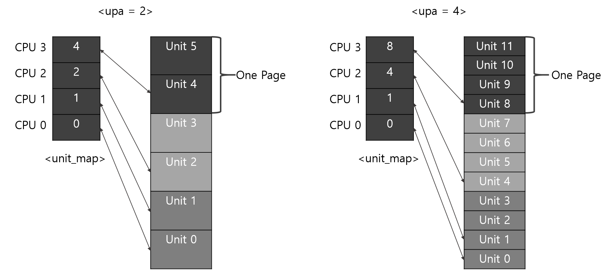

# Per CPU 완전 분석 노트 2

## Changelog

### 레드 블랙 트리 삭제\(Commit e1b9aa3f47242\)

가상 주소를 받고 그 주소의 대응하는 청크를 알려주는 pcpu\_chunk\_addr\_search의 구현이 달라졌다. 기존에는  레드 블랙 트리를 이용하였지만, 이제는 페이지 디스크립터안에 소속된 chunk를 저장한다. 핵심적인 변화 사항은 아래와 같다.



```c
struct pcpu_chunk {
    ...
    struct rb_node      rb_node;    /* 삭제 */
    ...
}
```



```c
/* set the pointer to a chunk in a page struct */
static void pcpu_set_page_chunk(struct page *page, struct pcpu_chunk *pcpu)
{
   page->index = (unsigned long)pcpu;
}

/* obtain pointer to a chunk from a page struct */
static struct pcpu_chunk *pcpu_get_page_chunk(struct page *page)
{
   return (struct pcpu_chunk *)page->index;
}
```



### static chunk 초기화 함수에 더 많은 자유를 부여\(Commit 8d408b4be37b\)

기존의 pcpu\_setup\_static 함수는 static 영역을 할당한다. 남은 영역은 free size에 저장되고 이 영역은 dynamic하게 사용될 수 있다, 하지만 이 영역이 부족하다면 정규 할당자를 통해 새로운 chunk를 할당받아야 한다. 따라서 정규 할당자가 동작하지 않는 상황에서 chunk에 남는 공간이 없다면 문제가 발생한다. 

이를 해결하기 위한 커밋의 주 변경점은 아래 3가지와 같다.

1. PERCPU\_DYNAMIC\_RESERVE으로 아키텍쳐에 따라 필요한 dynamic 영역의 크기를 지정할 수 있다.
2. pcpu\_setup\_static 함수는 pcpu\_setup\_first\_chunk으로 명칭이 변경되었다.
3. pcpu\_setup\_first\_chunk에 unit의 크기나 dynamic 영역의 크기, base\_addr을 인자로 줄 수 있다.



```c
/* 아키텍쳐에서 명시적으로 지정하지 않는 경우 */

#ifndef PERCPU_DYNAMIC_RESERVE
#  if BITS_PER_LONG > 32
#    ifdef CONFIG_MODULES
#      define PERCPU_DYNAMIC_RESERVE   (6 << PAGE_SHIFT)
#    else
#      define PERCPU_DYNAMIC_RESERVE   (4 << PAGE_SHIFT)
#    endif
#  else
#    ifdef CONFIG_MODULES
#      define PERCPU_DYNAMIC_RESERVE   (4 << PAGE_SHIFT)
#    else
#      define PERCPU_DYNAMIC_RESERVE   (2 << PAGE_SHIFT)
#    endif
#  endif
#endif /* PERCPU_DYNAMIC_RESERVE */
```



### Reserved 영역 구현\(Commit edcb463997ed\)

기존의 first chunk에 static, dynmaic 영역 뿐만 아니라 시스템이 나중에 사용할 공간인 reserved 영역을 추가한다. 이 영역은 reserved 영역을 위한 특별한 할당자를 통해 사용한다.

만약 reserved 영역이 존재하면, first chunk는 reserved chunk로 간주되며 특별한 접근 방법이 필요하다. 만약 reserved 영역과 dynamic 영역 둘 모두 가진다면, dynamic 영역을 관리하는 가상\(?\) 청크가 생성된다.


 **1번과 3번**은 chunk가 슬롯에 연결되어 있다. 따라서 일반적인 할당자를 이용하여 해당 청크에서 새로운 영역을 할당받을 수 있다. 

**2번**의 경우 chunk에는 사용가능한 영역이 있지만 특별한 할당자를 이용한다. 

**4번**과 같은 경우는 같은 영역을 바라보는 2개의 청크가 있다. 하나는 reserved 영역을 위한 chunk가 있고 dynamic 영역을 위한 chunk가 따로 존재한다.

아래 코드를 살피며 어떻게 구현되었는지 알아보자. **+**로 표시된 라인은 새롭게 추가된 라인이다.

```c
size_t __init pcpu_setup_first_chunk(pcpu_get_page_fn_t get_page_fn,
+                                    size_t static_size, size_t reserved_size,
                                     ssize_t unit_size, ssize_t dyn_size,
                                     void *base_addr,
                                     pcpu_populate_pte_fn_t populate_pte_fn)
{
+       static int smap[2], dmap[2];
+       struct pcpu_chunk *schunk, *dchunk = NULL;
        ...
        
        if (reserved_size) {
+               schunk->free_size = reserved_size;
+               pcpu_reserved_chunk = schunk;   /* not for dynamic alloc */
+       } else {
+               schunk->free_size = dyn_size;
+               dyn_size = 0;                   /* dynamic area covered */
+       }
        schunk->contig_hint = schunk->free_size;

        schunk->map[schunk->map_used++] = -static_size;
        if (schunk->free_size)
                schunk->map[schunk->map_used++] = schunk->free_size;

+       pcpu_reserved_chunk_limit = static_size + schunk->free_size;
+
+       /* init dynamic chunk if necessary */
+       if (dyn_size) {
+               dchunk = alloc_bootmem(sizeof(struct pcpu_chunk));
+               INIT_LIST_HEAD(&dchunk->list);
+               dchunk->vm = &first_vm;
+               dchunk->map = dmap;
+               dchunk->map_alloc = ARRAY_SIZE(dmap);
+               dchunk->page = schunk->page_ar; /* share page map with schunk */
+
+               dchunk->contig_hint = dchunk->free_size = dyn_size;
+               dchunk->map[dchunk->map_used++] = -pcpu_reserved_chunk_limit;
+               dchunk->map[dchunk->map_used++] = dchunk->free_size;
+       }
+
        /* Dynamic 할당을 위한 chunk를 슬롯에 등록한다 */
+       if (!dchunk) {
+               pcpu_chunk_relocate(schunk, -1);
+               pcpu_chunk_addr_insert(schunk);
+       } else {
+               pcpu_chunk_relocate(dchunk, -1);
+               pcpu_chunk_addr_insert(dchunk);
+       }
```

* **Line 7~8**:두 개의  청크를 위한 정적 배열과 chunk 포인터이다.
* **Line 11~13**: reserved 영역이 있다면, schunk는 reserved chunk로 간주되며 남은 공간을 기록한다.
* **Line 14~16:** reserved 영역이 없으므로 schunk의 남는 공간은 dynamic 영역이 사용한다. 해당 chunk에 dynamic 영역이 할당 되었으므로 필요한 dynamic 사이즈는 0으로 세팅한다.
* **Line 20:** schunk의 첫 번째 영역은 static 영역이 차지하므로 map에 기록한다.
* **Line 21~22:** schunk에 남는 공간이 있다면 map에 기록한다.
* **Line 24:** 의미는 static + reserved 영역의 끝\(dynamic의 시작 위치\)이다.
* **Line 27:** 해당 라인 부터는 reserved 영역과 dynamic 영역이 모두 존재하는 경우만 다루는 코드이다.
* **Line 28~33:** dynamic 영역을 위한 chunk를 할당/초기화 한다.
* **Line 35~37**: dynamic 영역의 크기를 map에 저장하고, 이전의 영역\(static + reserved\) 영역은 사용하지 못하는 영역이라고 map에 기록한다.
* **Line 41~47**: dynamic 영역을 가진 청크를 슬롯에 넣는다. 

### Embeded first Chunk setup 헬퍼 함수 일반화\(Commit 66c3a7577224\)

x86 아키텍처에서는 first chunk를 생성하는 ebedding first chunk setup helper를 가졌다. 이제 해당 함수르 다른 아키텍처에서 사용하는 default first chunk allocator으로 도입했다.

pcpu\_setup\_first\_chunk에서 한 것은 first chunk 구조체를 생성했고, 해당 chunk가 관리하는 실제 영역은 할당 하지 않았다. 따라서 first chunk가 관리하는 실제 영역을 할당하고, Prehistoric implementation의 setup\_per\_cpu\_area에서 한 것처럼 chunk에 percpu 섹션을 복사한다. 

아래는 추가된 함수이다

```c
ssize_t __init pcpu_embed_first_chunk(size_t static_size, size_t reserved_size,
                      ssize_t dyn_size, ssize_t unit_size)
{
    unsigned int cpu;

    /* determine parameters and allocate */
    pcpue_size = PFN_ALIGN(static_size + reserved_size +
                   (dyn_size >= 0 ? dyn_size : 0));
    if (dyn_size != 0)
        dyn_size = pcpue_size - static_size - reserved_size;

    if (unit_size >= 0) {
        BUG_ON(unit_size < pcpue_size);
        pcpue_unit_size = unit_size;
    } else
        pcpue_unit_size = max_t(size_t, pcpue_size, PCPU_MIN_UNIT_SIZE);

    pcpue_ptr = __alloc_bootmem_nopanic(
                    num_possible_cpus() * pcpue_unit_size,
                    PAGE_SIZE, __pa(MAX_DMA_ADDRESS));
    if (!pcpue_ptr)
        return -ENOMEM;

    /* return the leftover and copy */
    for_each_possible_cpu(cpu) {
        void *ptr = pcpue_ptr + cpu * pcpue_unit_size;

        free_bootmem(__pa(ptr + pcpue_size),
                 pcpue_unit_size - pcpue_size);
        memcpy(ptr, __per_cpu_load, static_size);
    }

    return pcpu_setup_first_chunk(pcpue_get_page, static_size,
                      reserved_size, dyn_size,
                      pcpue_unit_size, pcpue_ptr, NULL);
}
```

* **Line 7~16:** unit의 사이즈를 인자에 따라 계산한다.
* **Line 18:** chunk가 실제로 관리하는 영역을 할당한다.
* **Line 25~31:** 할당된 영역에 static 영역을 복사한다.
* **Line 33:** first chunk를 생성한다.

### Drop pcpu\_chunk-&gt;page\[\] \(Commit ce3141a277ff\)

 기존의 percpu는 페이지 디스크립터 포인터 배열을 이용하여 해당 페이지가 할당되었는지 확인할 수 있었다. 이제는 비트맵을 통해 페이지가 할당되었는지 확인한다. page에 접근하기위해서 vmalloc\_to\_page\(\)를 대신 이용한다.



```c
struct pcpu_chunk {
        int                     map_alloc;      /* # of map entries allocated */
        int                     *map;           /* allocation map */
        bool                    immutable;      /* no [de]population allowed */
-       struct page             *page[];        /* 삭제 */
+       unsigned long           populated[];    /* populated bitmap */
 };
```



```c
static struct page *pcpu_chunk_page(struct pcpu_chunk *chunk,
                                   unsigned int cpu, int page_idx)
{
       /* must not be used on pre-mapped chunk */
       WARN_ON(chunk->immutable);
       
       /* vmalloc_to_page를 사용 */
       return vmalloc_to_page((void *)pcpu_chunk_addr(chunk, cpu, page_idx));
 }
```



 아래는 비트맵의 iterarting에 사용되는 함수들이다.

```c
static void pcpu_next_unpop(struct pcpu_chunk *chunk, int *rs, int *re, int end)
{
       /* bitmap에 0인 구간의 시작과 위치를 넘겨준다.
        *
        * 11110000000011111111000
        *     ↑      ↑
        *   *rs     *re
        */
       *rs = find_next_zero_bit(chunk->populated, end, *rs);
       *re = find_next_bit(chunk->populated, end, *rs + 1);
}

static void pcpu_next_pop(struct pcpu_chunk *chunk, int *rs, int *re, int end)
{
       /* bitmap에 1인 구간의 시작과 위치를 넘겨준다.
        *
        * 11110000000011111111000
        *             ↑      ↑
        *            *rs     *re
        */
       *rs = find_next_bit(chunk->populated, end, *rs);
       *re = find_next_zero_bit(chunk->populated, end, *rs + 1);
}

#define pcpu_for_each_unpop_region(chunk, rs, re, start, end)              \
       for ((rs) = (start), pcpu_next_unpop((chunk), &(rs), &(re), (end)); \
            (rs) < (re);                                                   \
            (rs) = (re) + 1, pcpu_next_unpop((chunk), &(rs), &(re), (end)))

#define pcpu_for_each_pop_region(chunk, rs, re, start, end)                \
       for ((rs) = (start), pcpu_next_pop((chunk), &(rs), &(re), (end));   \
            (rs) < (re);                                                   \
            (rs) = (re) + 1, pcpu_next_pop((chunk), &(rs), &(re), (end)))
```

* **Line 9**: find\_next\_zero\_bit\(addr, end, start\) 함수는 **\[start,end-1\] 구간**에 대해 0인 비트의 위치를 리턴한다. 이와 같은 형식은 다른 find\_next\_\* 함수들 모두 다 공통된다. 따라서 \[\*rs,end-1\]에서 0인 비트의 위치를 \*rs에 저장한다.
* **Line 10**: \[\*rs+1,end-1\]에서 1인 비트의 위치를 \*re에 저장한다.
* **Line 13~23:** 위 함수의 반대의 일을 수행한다.
* **Line 25~28**: 비트맵에 0인 구간들을 순회한다. 각 구간의 시작과 끝은 rs와 re에 담긴다.
* **Line 30~33**: 위 함수의 반대의 일을 수행한다.

population 정보를 담당하는 데이터 구성이 변경되었으므로 populate하는 함수 또한 변경됐다.



```c
 static int pcpu_populate_chunk(struct pcpu_chunk *chunk, int off, int size)
 {
        int page_start = PFN_DOWN(off);
        int page_end = PFN_UP(off + size);
+       int free_end = page_start, unmap_end = page_start;
+       struct page **pages;
+       unsigned long *populated;
        unsigned int cpu;q
+       int rs, re, rc;

+       /* quick path, poulate하려는 페이지가 모두 populate되었는지 확인 */
+       pcpu_for_each_pop_region(chunk, rs, re, page_start, page_end) {
+               if (rs == page_start && re == page_end)
+                       goto clear;
+               break;
+       }
        /* pages와 populated를 할당 받는다. */
+       pages = pcpu_get_pages_and_bitmap(chunk, &populated, true);
+       if (!pages)
+               return -ENOMEM;
...
```



```c
static struct page **pcpu_get_pages_and_bitmap(struct pcpu_chunk *chunk,
+                                              unsigned long **bitmapp,
+                                              bool may_alloc)
+{
+       static struct page **pages;
+       static unsigned long *bitmap;
+       size_t pages_size = num_possible_cpus() * pcpu_unit_pages *
+                           sizeof(pages[0]);
+       size_t bitmap_size = BITS_TO_LONGS(pcpu_unit_pages) *
+                            sizeof(unsigned long);
+
+       /* 인자가 NULL이라는 말은 할당해야 하는 곳이란 말이다 */
+       if (!pages || !bitmap) {
+               if (may_alloc && !pages)
+                       pages = pcpu_mem_alloc(pages_size);
+               if (may_alloc && !bitmap)
+                       bitmap = pcpu_mem_alloc(bitmap_size);
+               if (!pages || !bitmap)
+                       return NULL;
+       }
+
+       /* 페이지 디스크립터 배열을 초기화 */
+       memset(pages, 0, pages_size);
+       /* 청크의 비트맵을 복사한다 */
+       bitmap_copy(bitmap, chunk->populated, pcpu_unit_pages);
+
+       *bitmapp = bitmap;
+       return pages;
+}
+
```



pcpu\_populate\_chunk

* **Line 12~16:** populate하려는 곳의 페이지가 모두 할당되어 있다면,  아무것도 안해도 된다.
* **Line 18:** 새로운 페이지를 생성, 매핑하려고 임시 비트맵과 임시 페이지 디스크립터 배열을 할당한다.



```c
+       /* [page_start, page_end-1]에서 이가 빠진 부분(unpop)에 페이지를 할당한다. */
+       pcpu_for_each_unpop_region(chunk, rs, re, page_start, page_end) {
+               rc = pcpu_alloc_pages(chunk, pages, populated, rs, re);
+               if (rc)
+                       goto err_free;
+               free_end = re;
        }
        /* [page_start, page_end-1]에서 이가 빠진 부분(unpop)을 populate한다. */
+       pcpu_for_each_unpop_region(chunk, rs, re, page_start, page_end) {
+               rc = pcpu_map_pages(chunk, pages, populated, rs, re);
+               if (rc)
+                       goto err_unmap;
+               unmap_end = re;
+       }
+       pcpu_post_map_flush(chunk, page_start, page_end);

+       /* commit new bitmap */
+       bitmap_copy(chunk->populated, populated, pcpu_unit_pages);
+clear:
        for_each_possible_cpu(cpu)
                memset(chunk->vm->addr + cpu * pcpu_unit_size + off, 0,
                       size);
        
        /* 이하 생략 */
}
```



```c
+static int pcpu_alloc_pages(struct pcpu_chunk *chunk,
+                           struct page **pages, unsigned long *populated,
+                           int page_start, int page_end)
+{
+       const gfp_t gfp = GFP_KERNEL | __GFP_HIGHMEM | __GFP_COLD;
+       unsigned int cpu;
+       int i;
+
+       for_each_possible_cpu(cpu) {
+               for (i = page_start; i < page_end; i++) {
+                       /* 인자로 받은 곳에 할당받은 페이지를 넣어준다. */
+                       struct page **pagep = &pages[pcpu_page_idx(cpu, i)];
+
+                       *pagep = alloc_pages_node(cpu_to_node(cpu), gfp, 0);
+                       if (!*pagep) {
+                               pcpu_free_pages(chunk, pages, populated,
+                                               page_start, page_end);
+                               return -ENOMEM;
+                       }
+               }
+       }
+       return 0;
+}
```



```c
+static int pcpu_map_pages(struct pcpu_chunk *chunk,
+                         struct page **pages, unsigned long *populated,
+                         int page_start, int page_end)
{
+       unsigned int cpu, tcpu;
+       int i, err;

        for_each_possible_cpu(cpu) {
                err = map_kernel_range_noflush(pcpu_chunk_addr(chunk, cpu, page_start),
                                               (page_end - page_start) << PAGE_SHIFT,
                                                PAGE_KERNEL,
+                                               &pages[pcpu_page_idx(cpu, page_start)]);
                if (err < 0)
+                       goto err;
        }

+       /* mapping successful, link chunk and mark populated */
+       for (i = page_start; i < page_end; i++) {
+               for_each_possible_cpu(cpu)
                        pages[pcpu_page_idx(cpu, i)]->index = chunk;
+               __set_bit(i, populated);
+       }
+
+       return 0;
/* 에러 처리 */
}
```



 

* **Line 2~7:** 비트맵을 순회하면서 populated 되지 않은 페이지들을 할당한다.
* **Line 9~14:** 새로 할당한 페이지들을 가상 주소와 매핑한다. 또한 비트맵에 새롭게 populated된 페이지들을 기록한다.
* **Line 15:** 페이지 테이블에 변화 사항이 생겼으므로, TLB를 업데이트 해준다.
* **Line 18:** 새로운 내용이 업데이트된 비트맵을 chunk에 복사한다.
* **Line 20~22:** 매핑된 페이지들을 0으로 초기화한다.

### 유닛과 CPU의 관계를 비선형적으로 할 수 있게 한다.\(Commit 2f39e637ea24\)

 기존에는 CPU와 Unit은 선형적인 관계였다면, 이제는 1대1 대응을 이루기만 한다면 비선형적인 관계를 가질 수 있도록 한다. 즉, CPU가 다른 Unit에 대응할 수 있도록 테이블을 구성한다.



  따라서 pcpu\_setup\_first\_chunk 함수는 unit\_map을 통한 초기화과정을 추가하였다. 추가된 코드는 인자로 받은 unit map이 1대1 대응\(동일한 unit을 가리키는 cpu가 없도록\)을 이루는지 확인하고, 첫번째 unit과 마지막 unit을 저장하고, 총 유닛 수\(마지막 unit + 1\)을 저장한다. 



```c
size_t __init pcpu_setup_first_chunk(size_t static_size, size_t reserved_size,
                                     ssize_t dyn_size, size_t unit_size,
+                                    void *base_addr, const int *unit_map){
        /* 중간 생 */
        BUG_ON(unit_size & ~PAGE_MASK);
        BUG_ON(unit_size < PCPU_MIN_UNIT_SIZE);

+       /* 인자로 만들어진 unit map이 있다면, unit map이 1대1 대응을 이루는지
+        * 확인하고, 아니라면 BUG_ON을 뱉는다. 또한 possible한 첫번째 cpu와
+        * 마지막 cpu를 저장하고, 필요한 유닛의 수를 pcpu_nr_units에 저장한다.
+        *
+        * 인자로 못받았다면, indentity map을 생성하여, 이전의 방식처럼 작동
+        * 하게 한다.
+        */
+       if (unit_map) {
+               int first_unit = INT_MAX, last_unit = INT_MIN;
+
+               for_each_possible_cpu(cpu) {
+                       int unit = unit_map[cpu];
+
+                       BUG_ON(unit < 0);
+                       for_each_possible_cpu(tcpu) {
+                               if (tcpu == cpu)
+                                       break;
+                               /* the mapping should be one-to-one */
+                               BUG_ON(unit_map[tcpu] == unit);
+                       }
+
+                       if (unit < first_unit) {
+                               pcpu_first_unit_cpu = cpu;
+                               first_unit = unit;
+                       }
+                       if (unit > last_unit) {
+                               pcpu_last_unit_cpu = cpu;
+                               last_unit = unit;
+                       }
+               }
+               pcpu_nr_units = last_unit + 1;
+               pcpu_unit_map = unit_map;
+       } else {
+               int *identity_map;
+
+               /* #units == #cpus, identity mapped */
+               identity_map = alloc_bootmem(num_possible_cpus() *
+                                            sizeof(identity_map[0]));
+
+               for_each_possible_cpu(cpu)
+                       identity_map[cpu] = cpu;
+
+               pcpu_first_unit_cpu = 0;
+               pcpu_last_unit_cpu = pcpu_nr_units - 1;
+               pcpu_nr_units = num_possible_cpus();
+               pcpu_unit_map = identity_map;
+       }
+
+       /* determine basic parameters */
        pcpu_unit_pages = unit_size >> PAGE_SHIFT;
        /* 생략 */
}
```



```c
static int pcpu_page_idx(unsigned int cpu, int page_idx)
 {
+       return pcpu_unit_map[cpu] * pcpu_unit_pages + page_idx;
 }
```



### Large Page first chunk allocator에 NUMA 친화적으로 변경\(Commit a530b7958612\)

Large Page first allocator은 Large Page를 사용하는 시스템에서 사용하였는데, 이 시스템은 주로 NUMA 시스템이다. 위 함수는 cpu당 하나씩 large page를 할당한다. 이러한 방식은 가상 주소 영역을 낭비한다. 

이를 해결하기 위해  NUMA 구성 요소를 알려주고, **같은 노드에 속한 cpu들은 같은 페이지**를 공유할 수 있도록 만든다. 


해당 패치는 앞의 패치\(Commit 2f39e637ea24\)에서 도입된 **unit\_map**를 활용한다.


```c
static ssize_t __init setup_pcpu_lpage(size_t static_size, bool chosen)
 {
        size_t reserve = PERCPU_MODULE_RESERVE + PERCPU_DYNAMIC_RESERVE;
+       size_t dyn_size = reserve - PERCPU_FIRST_CHUNK_RESERVE;
+       size_t unit_map_size, unit_size;
+       int *unit_map;
+       int nr_units;
+       ssize_t ret;

        /* 중간 생략 */

+       /* allocate and build unit_map */
+       unit_map_size = num_possible_cpus() * sizeof(int);
+       unit_map = alloc_bootmem_nopanic(unit_map_size);
+       if (!unit_map) {
+               pr_warning("PERCPU: failed to allocate unit_map\n");
+               return -ENOMEM;
+               pr_warning("PERCPU: failed to allocate unit_map\n");
+               return -ENOMEM;
+       }
+
+       ret = pcpu_lpage_build_unit_map(static_size,
+                                       PERCPU_FIRST_CHUNK_RESERVE,
+                                       &dyn_size, &unit_size, PMD_SIZE,
+                                       unit_map, pcpu_lpage_cpu_distance);
+       if (ret < 0) {
+               pr_warning("PERCPU: failed to build unit_map\n");
+               goto out_free;
+       }
+       nr_units = ret;

        /* 중간 생략 */

+       ret = pcpu_lpage_first_chunk(static_size, PERCPU_FIRST_CHUNK_RESERVE,
+                                    dyn_size, unit_size, PMD_SIZE,
+                                    unit_map, nr_units,
+                                    pcpu_fc_alloc, pcpu_fc_free, pcpul_map);
+out_free:
+       if (ret < 0)
+               free_bootmem(__pa(unit_map), unit_map_size);
+       return ret;
 }
```

* **Line 13~20**에서는 **unit\_map**에 메모리를 할당한다.
* **Line 22**에서 실제 **unit\_map** 구성이 완성된다.
* **Line 34**에서는 만들어진 **unit\_map**을 가지고 **first chunk**를 셋업한다.

unit map을 build하는 과정에는 해당 패치의 핵심적인 내용이 담겨있다. 앞에서 말했듯이 같은 노드의 cpu가 같은 페이지를 공유하도록 만든다. 그렇다면 두 가지의 문제를 해결해야한다.

* **어떤 cpu가 어떤 node에 속하는가?**
* **하/나의 페이지를 \(같은 노드의\) 몇 개의 cpu가 공유할 것인가?**

이를 해결하기 위해 새로운 개념을 도입한다.

* group 도입. 여기서 group이란 NUMA node라고 봐도 무방하다.
  * group\_map : cpu가 속하는 group
  * group\_cnt : group에 속하는 cpu 수
* upa\(Unit per alloc\) 도입
  * 한 페이지에 몇 개의 cpu\(unit\)가 들어갈지 정하는 수.
  * Page size = Unit Size \* upa

 아래 예시를 살펴보며, group에 대해 알아보자.



위 그림에는 예시 NUMA 시스템이 있고, CPU 0,1은 로컬 메모리로 NUMA1을 가진다. CPU 2는 NUMA 1을, CPU3은 NUMA 2를 로컬 메모리로 가진다. 이러한 구성 형태를 group으로 나타내면 우상단 표와 같다.

**group\_map**은 각 cpu가 속하는 NUMA 노드 번호를 저장한다. **group\_cnt**는 각 group\(NUMA\)에 속하는 CPU 수를 저장한다.

위 시스템에서 upa에 따라 구성되는 unit\_map을 살펴보자.



 **upa가 2일 때** 구성되는 unit map을 살펴보자. 한 페이지에는 2개의 unit이 들어간다. 같은 group에 속하는 CPU 0과 1은 동일한 페이지에 있는  unit 0과 unit1을 매핑한다. CPU 2와 CPU 3은 각기 다른 group에 속하기 때문에 다른 페이지에 속해야 한다. 따라서 CPU 3은 unit 3 대신 unit 4를 매핑한다.

**upa가 4일 때,** 한 페이지에는 4개의 unit이 들어간다. 같은 group에 속하는 CPU 0과 1은 동일한 페이지에 있는  unit 0과 unit1을 매핑한다. CPU 2와 CPU 3는 각기 다른 페이지에 존재하는 unit 4와 unit 8을 매핑한다.

그럼 어떤 upa를 선택해야 할까? 가장 좋은 upa는 낭비되는 가상 주소 영역이 적고, 할당되는 페이지 수가  적은 것으로 선정한다. 

이제 구체적인 내용은 코드를 보며 살펴보자.

```c
int __init pcpu_lpage_build_unit_map(size_t static_size, size_t reserved_size,
                     ssize_t *dyn_sizep, size_t *unit_sizep,
                     size_t lpage_size, int *unit_map,
                     pcpu_fc_cpu_distance_fn_t cpu_distance_fn)
{
    static int group_map[NR_CPUS] __initdata;
    static int group_cnt[NR_CPUS] __initdata;
    int group_cnt_max = 0;
    
    /* 생략 */

    /* group_map, group_cnt를 세팅한다. */
    for_each_possible_cpu(cpu) {
        group = 0;
    next_group:
        for_each_possible_cpu(tcpu) {
            if (cpu == tcpu)
                break;
            if (group_map[tcpu] == group &&
                (cpu_distance_fn(cpu, tcpu) > LOCAL_DISTANCE ||
                 cpu_distance_fn(tcpu, cpu) > LOCAL_DISTANCE)) {
                group++;
                goto next_group;
            }
        }
        group_map[cpu] = group;
        group_cnt[group]++;
        group_cnt_max = max(group_cnt_max, group_cnt[group]);
    }
```

위에 코드는 group\_cnt\[\]와 group\_map\[\]을 세팅하는 과정이다. next\_group으로 goto하는 방식 때문에 바로 이해하기 어렵긴 하지만 결과적으로 group\_cnt\[\]와 group\_map\[\]이 cpu간 distance에 따라 분류된다.

```c
        ...
        size_t size_sum, min_unit_size, alloc_size;
        int upa, max_upa, uninitialized_var(best_upa);  /* units_per_alloc */
        int last_allocs;
        unsigned int cpu, tcpu;
        int group, unit;

        /*
         * Determine min_unit_size, alloc_size and max_upa such that
         * alloc_size is multiple of lpage_size and is the smallest
         * which can accomodate 4k aligned segments which are equal to
         * or larger than min_unit_size.
         */
        size_sum = pcpu_calc_fc_sizes(static_size, reserved_size, dyn_sizep);
        min_unit_size = max_t(size_t, size_sum, PCPU_MIN_UNIT_SIZE);

        alloc_size = roundup(min_unit_size, lpage_size);
        upa = alloc_size / min_unit_size;
        while (alloc_size % upa || ((alloc_size / upa) & ~PAGE_MASK))
                upa--;
        max_upa = upa;
        
        /* group 세팅 */
                
        last_allocs = INT_MAX;
        for (upa = max_upa; upa; upa--) {
                int allocs = 0, wasted = 0;

                if (alloc_size % upa || ((alloc_size / upa) & ~PAGE_MASK))
                        continue;

                for (group = 0; group_cnt[group]; group++) {
                        int this_allocs = DIV_ROUND_UP(group_cnt[group], upa);
                        allocs += this_allocs;
                        wasted += this_allocs * upa - group_cnt[group];
                }

                /*
                 * Don't accept if wastage is over 25%.  The
                 * greater-than comparison ensures upa==1 always
                 * passes the following check.
                 */
                if (wasted > num_possible_cpus() / 3)
                        continue;

                /* and then don't consume more memory */
                if (allocs > last_allocs)
                        break;
                last_allocs = allocs;
                best_upa = upa;
        }
        *unit_sizep = alloc_size / best_upa;
```

upa를 산출하는 과정이다.  alloc size는 unit의 사이즈의 배수가 되어야한다. 즉,

 alloc\_size = upa \* unit\_size와 같다. 

alloc\_size의 약수 중 모든 upa에 대해 최고의 upa 찾아야 하는데, 이것은 일종의 소인수 분해 동일하다. 소인수 분해를 하는 대신 brute forcing하며 약수가 되는 upa를 찾아 낸다. 낭비되는 메모리가 적은 upa를 선택한다.

```c
        ...
        
        /* assign units to cpus accordingly */
        unit = 0;
        for (group = 0; group_cnt[group]; group++) {
                for_each_possible_cpu(cpu)
                        if (group_map[cpu] == group)
                                unit_map[cpu] = unit++;
                unit = roundup(unit, best_upa);
        }
        
        return unit;
}
```

이제 앞에서 계산한 group\_cnt, group\_map, upa를 활용하여 unit\_map을 생성한다.

  

