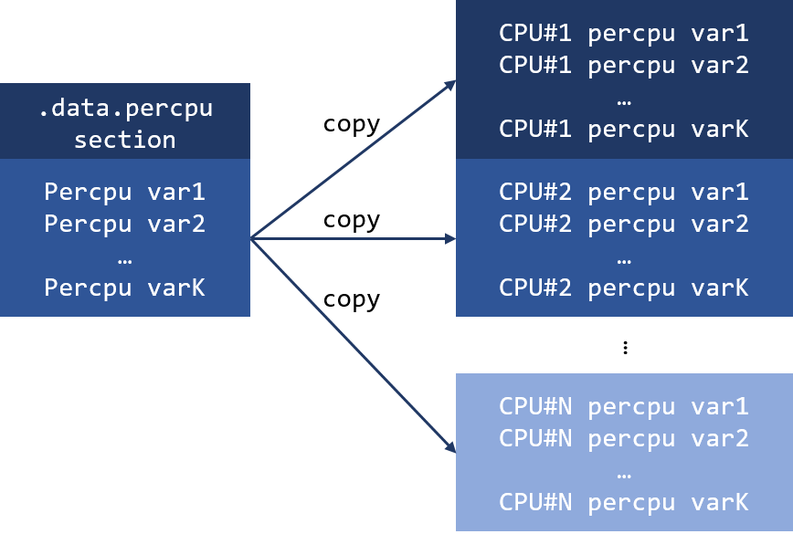
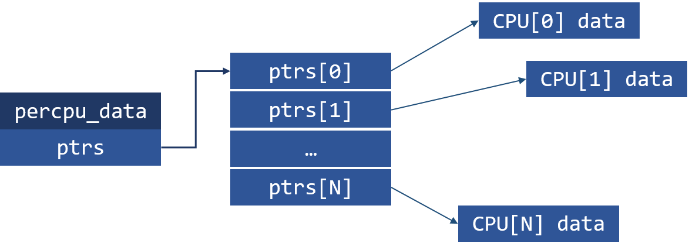
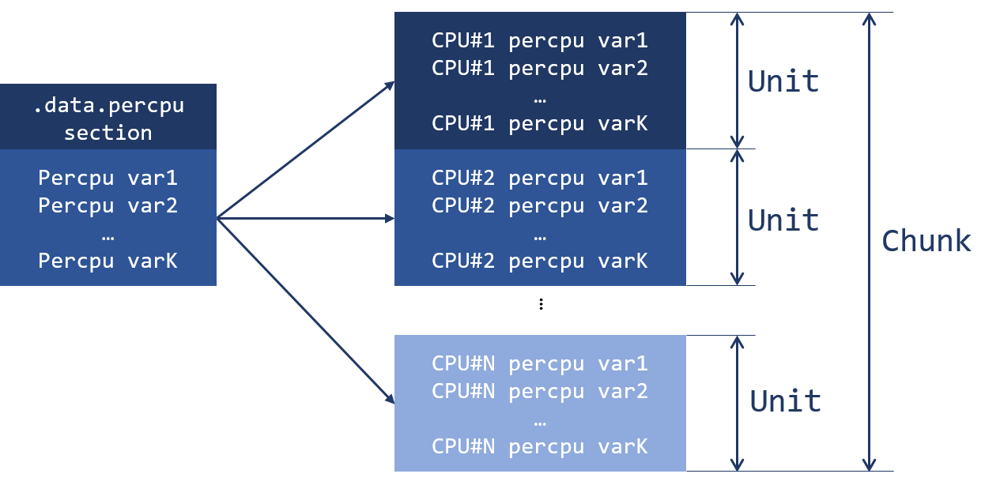
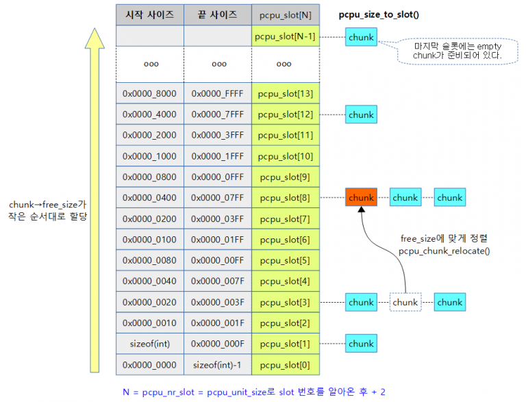
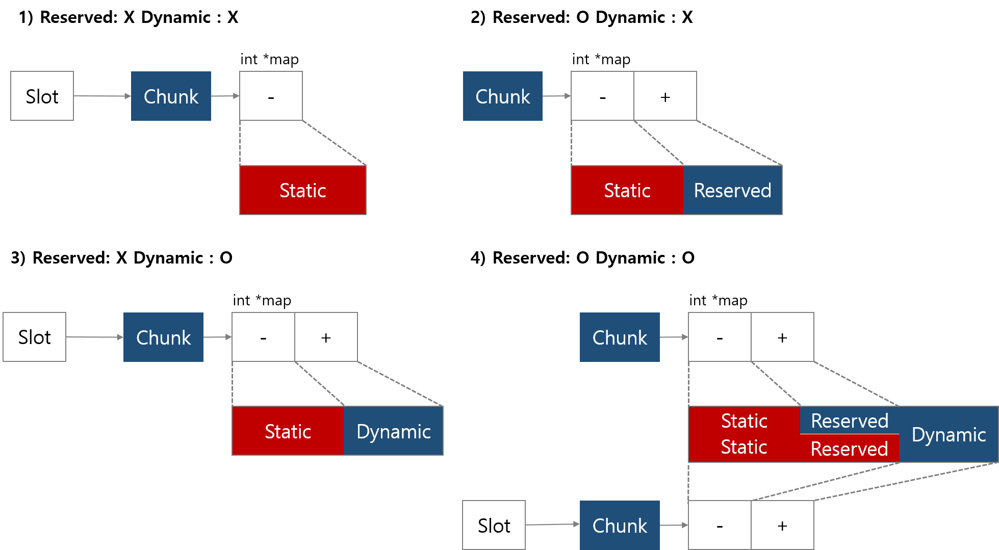

# Per CPU 완전 분석 노트

Per-cpu는 "[percpu: implement new dynamic percpu allocator](https://github.com/iamroot16/linux/commit/fbf59bc9d74d1fb30b8e0630743aff2806eafcea#diff-5050eed868076fe2656aea8c2eb7312a)"의 패치로 리뉴얼 되었다. 또한 뒤따르는 후속 패치들로 2800줄에 이르는 코드가 되었다. 다양한 내용이 반영된 최신의 percpu.c 파일을 분석하기보다는 몇 줄 안되는 초창기 버전의 percpu.c를 분석하며, percpu란 어떻게 구현되었는지 알아보자.

## Prehistoric implementation

우선 percpu가 재구현되기 전에 모습을 살펴보고, 어떤 점 때문에 대대적으로 수정되었는지 살펴보자. 재구현 이전의 percpu은 static과 dynamic이 서로 다른 구조로 구현되었고, 따라서 서로 다른 인터페이스를 가진다. 

### Static percpu variable


```c
#define PER_CPU_BASE_SECTION ".data.percpu"

#define DEFINE_PER_CPU_SECTION(type, name, section)			\
	__attribute__((__section__(PER_CPU_BASE_SECTION section)))	\
	PER_CPU_ATTRIBUTES __typeof__(type) per_cpu__##name

#define DEFINE_PER_CPU(type, name)					\
	DEFINE_PER_CPU_SECTION(type, name, "")
```


Static percpu 변수는 DEFINE\_PER\_CPU 매크로를 사용하여 선언할 수 있다. 

DEFINE\_PER\_CPU 매크로는 변수를 생성하는데,

1. 이 변수의 타입은 인자로 받은 type이다.
2. 이 변수의 이름은 per\_cpu\_\_\#\#name이다.
3. 이 변수는 .data.percpu 섹션에 위치한다.

단순히 DEFINE하는 것으로 static percpu 변수로 활용할 수 없다. 사용하기 위해서는 setup\_per\_cpu\_areas\(\) 함수를 통해 초기화해야 한다. 

```c
static void __init setup_per_cpu_areas(void)
{
	unsigned long size, i;
	char *ptr;
	unsigned long nr_possible_cpus = num_possible_cpus();

	/* Copy section for each CPU (we discard the original) */
	/* PERCPU_ENOUGH_ROOM = __per_cpu_end - __per_cpu_start + PERCPU_MODULE_RESERVE */
	size = ALIGN(PERCPU_ENOUGH_ROOM, PAGE_SIZE);
	ptr = alloc_bootmem_pages(size * nr_possible_cpus);

	for_each_possible_cpu(i) {
		__per_cpu_offset[i] = ptr - __per_cpu_start;
		memcpy(ptr, __per_cpu_start, __per_cpu_end - __per_cpu_start);
		ptr += size;
	}
}
```

  해당 함수는 static percpu를 초기화하기 위해 필요한 용량을 구한 후 할당한다. 각각의 cpu에 대응하는 영역에 .data.percpu의 값들을 복사하고 위치를 기록한다.  



### Dynamic percpu variable


```c
struct percpu_data {	
    void *ptrs[NR_CPUS];
};
```


 옛 **Dynamic percpu 변수**의 경우, 위와 같이 선언되었으며 그 구성은 간단하다. 이를 그림으로 표현하면 아래와 같다.



 해당 구조로 인해, 

* 데이터에 접근하기 위해 메모리 참조가 2번 필요하다.
* 할당할 때, 실제 데이터의 크기\(CPU 개수 \* 자료형 크기\)보다  더 많은 메모리가 요구된다.

### Key point

앞서 말한대로 static과 dynamic의 구조는 서로 다르다. 따라서 **서로 다른 percpu를 하나로 통합**하는 것이 주요 과제이다. 이제 이것을 어떻게 구현했는지 살펴보자.

## Reimplementation

 새로운 dynamic percpu는 이전의 static percpu의 구조를 그대로 사용하여 통일된 percpu를 이룬다. static percpu를 초기화한 setup\_percpu\_area함수처럼, 연속된 커다란 메모리를 할당받고, cpu마다 공평하게 나눠가지도록 한다. 여기서 연속된 하나의 커다란 메모리를 **chunk**라 하고, cpu마다 분배받은 영역을 **unit**이라 한다.



 static percpu의 경우 chunk를 할당하고 각각의 unit에 복사하면 끝이지만, dynamic은 **unit 내의 가용 공간을 관리**해야 한다. 또한 chunk 내의 가용 공간이 부족하면 새로운 chunk를 만들어야 한다. 따라서 chunk는 여러 개일 수 있고, 특정 chunk를 **검색할 수 있도록 chunk 간 관계**를 구성해야한다. 

위 내용에 초점을 맞추면서 Chunk 구조체를 들여다 보자.

```c
struct pcpu_chunk {
    /* 청크 검색을 위한 멤버 */
    struct list_head    list;       /* 연결 리스트로 청크를 관리하기 위함. */
    int         free_size;          /* 적합한 청크를 검색하기 위한 멤버. */
    int         contig_hint;        /* 할당할 공간이 있는지 위한 멤버. */
    
    struct rb_node      rb_node;    /* 주소에 대응하는 청크를 찾기 위한 멤버 */
    
    /* 청크 내부 메모리 관리를 위한 멤버 */
    struct vm_struct    *vm;        /* 청크에 대응하는 가상 주소를 저장 */
    int         map_used;           /* map의 length */
    int         map_alloc;          /* map에서 사용되고 있는 엔트리의 수 */
    int         *map;               /* 청크의 메모리를 관리하는 벡터 */
    struct page     *page[];        /* 가상 주소에 대응하는 물리 페이지 디스크립터 배열 */
}
```

앞서 말한대로 chunk 내부의 멤버들은 크게 2가지로 분류된다. 첫 번째로는 청크 검색을 위한 멤버, 두 번째는 할당받은 메모리 관리를 위한 멤버이다. 이제 이 두 가지 종류의 멤버에 대해 자세히 알아보자.

### Chunk's internal memory management

 위에서 chunk는 할당받은 커다란 연속된 메모리라 하였다. 실제적으로는 연속된 가상 메모리를 할당받고 물리 페이지와의 매핑은 필요할 때까지 미루어진다. 즉, 멤버 변수 **vm**은 **get\_vm\_area**를 통해 청크에 할당된 가상 주소 영역이다. 


 chunk는 유닛 내의 할당된 공간/사용 가능한 공간을 관리해야 한다고 말했다. 이를 위해 **map**이 사용된다.


최신 버전에서 chunk 내 메모리 관리 방식는 이와 다르며 원한다면 생략해도 된다.  


map은 unit 내의 할당 정보를 저장하고 있는 벡터이다. 할당된/할당되지 않은 연속된 범위에 대해 하나의 엔트리를 가진다. 할당된 영역은 음수로, 할당되지 않은 영역은 양수로 저장된다.


해당 자료 구조의 특성으로 새로운 엔트리가 삽입될 때, 다시 map를 갱신해야 한다. 할당 가능한 연속된 영역을  전부 사용한다면 단순히 음수로 변경하면 되지만, 일부만 사용한다면 영역은 쪼개지개 되며 새로운 엔트리를 생성해야 한다. 


이 역할을 수행하는 함수가 **pcpu\_split\_block**이다. 새롭게 생겨나는 앞 쪽 영역을 head, 뒤 쪽 영역을 tail이라 하며 인자로 해당 영역들의 크기를 넘겨준다.

```c
/*
 * head: 새롭게 생겨나는 head의 크기 없다면 0
 * tail: 새롭게 생겨나는 tail의 크기 없다면 0
 */
static int pcpu_split_block(struct pcpu_chunk *chunk, int i, int head, int tail)
{
    /* nr_extra: 새롭게 생겨나는 영역의 수.*/
    int nr_extra = !!head + !!tail;
    int target = chunk->map_used + nr_extra;

    /* reallocation required? */
    if (chunk->map_alloc < target) {
        int new_alloc = chunk->map_alloc;
        int *new;
        while (new_alloc < target)
            new_alloc *= 2;

        new = pcpu_realloc(chunk->map,
                   chunk->map_alloc * sizeof(new[0]),
                   new_alloc * sizeof(new[0]));
        if (!new)
            return -ENOMEM;

        chunk->map_alloc = new_alloc;
        chunk->map = new;
    }

    /* insert a new subblock */
    memmove(&chunk->map[i + nr_extra], &chunk->map[i],
        sizeof(chunk->map[0]) * (chunk->map_used - i));
    chunk->map_used += nr_extra;

    /* head가 존재한다면, head만큼 split */
    if (head) {
        chunk->map[i + 1] = chunk->map[i] - head;
        chunk->map[i++] = head;
    }
    /* tail이 존재한다면, tail만큼 split */
    if (tail) {
        chunk->map[i++] -= tail;
        chunk->map[i] = tail;
    }
    return 0;
}
```

* **Line 8~9**: 새롭게 생성되는 영역의 수를 nr\_extra에 저장하고 target에 늘어난 엔트리의 수를 저장한다.
* **Line 12~26**: map 벡터의 크기가 작다면 늘린다.
* **Line 29~31**: i번째 이후 엔트리들은 nr\_extra만큼 시프트한다. chunk의 엔트리 수를 업데이트한다.
* **Line 34~37**: head가 존재한다면 head를 위한 엔트리를 생성한다.
* **Line 39~42**: tail이 존재한다면 tail을 위한 엔트리를 생성한다.

### Chunk searching

요청받은 크기의 percpu 변수를 할당하기 위해서는, 요청받은 크기를 할당 가능한 chunk를 찾아야한다. 단순하게 모든 chunk를 순회하면서 찾을 수 있지만, 효율적인 검색을 위해 **slot**을 도입했다.

```c
static struct list_head *pcpu_slot;     /* chunk list slots */

...

#define PCPU_SLOT_BASE_SHIFT        5   /* 1-31 shares the same slot */
```

 chunk의 free size에 따라 청크가 위치하는 슬롯이 다르다. 따라서 alloc/free에 의해 freesize가 변경되면 chunk를 올바른 슬롯에 재배치하는 pcpu\_chunk\_relocate를 호출해야 한다.



```c
#define PCPU_SLOT_BASE_SHIFT        5   /* 1-31 shares the same slot */

...

static int pcpu_size_to_slot(int size)
{
    int highbit = fls(size);     /* ilog2(size) */
    
    /* high bit가 4이하일때, slot index는 1 */
    return max(highbit - PCPU_SLOT_BASE_SHIFT + 2, 1);
}
```



```c
static int pcpu_chunk_slot(const struct pcpu_chunk *chunk)
{
    if (chunk->free_size < sizeof(int) || chunk->contig_hint < sizeof(int))
        return 0;

    return pcpu_size_to_slot(chunk->free_size);
}
```



```c
static void pcpu_chunk_relocate(struct pcpu_chunk *chunk, int oslot)
{
    int nslot = pcpu_chunk_slot(chunk);

    if (oslot != nslot) {
        if (oslot < nslot)
            list_move(&chunk->list, &pcpu_slot[nslot]);
        else
            list_move_tail(&chunk->list, &pcpu_slot[nslot]);
    }
}
```





### Dynamic percpu allocation 1

먼저 간단히 allocation 과정을 그려본다면, 

1. 요청받은 사이즈를 수용할 수 있는 chunk 찾는다.
2. 해당 chunk에 새로운 percpu 영역 할당한다. 즉, chunk 내부 자료구조들을 갱신한다.
3. 할당한 percpu에 대해 매핑이 되지 않은 가상 주소가 있다면 매핑한다.

위와 같이 3단계를 거칠 것이다. 이러한 점을 숙지하며 코드를 살펴보자.



```c
void *__alloc_percpu(size_t size, size_t align)
{
    void *ptr = NULL;
    struct pcpu_chunk *chunk;
    int slot, off;
    
    ...
    
    mutex_lock(&pcpu_mutex);

    /* 후보 슬롯들에 대해 순회한다 */
    for (slot = pcpu_size_to_slot(size); slot < pcpu_nr_slots; slot++) {
        /* 해당 슬롯에 소속된 청크들을 순회한다 */
        list_for_each_entry(chunk, &pcpu_slot[slot], list) {
            /* 해당 슬롯에 수용 가능한 용량이 있는지 확*/
            if (size > chunk->contig_hint)
                continue;
            off = pcpu_alloc_area(chunk, size, align);
            if (off >= 0)
                goto area_found;
            if (off != -ENOSPC)
                goto out_unlock;
        }
    }

    /* 요청을 수용하는 청크가 존재하지 않음. 새로운 청크 할당, 
     * 해당 청크에서 pcpu_alloc_area 호출
     *               내용 생략... 
     */
    
area_found:
    /* populate, map and clear the area */
    if (pcpu_populate_chunk(chunk, off, size)) {
        pcpu_free_area(chunk, off);
        goto out_unlock;
    }

    ptr = __addr_to_pcpu_ptr(chunk->vm->addr + off);
out_unlock:
    mutex_unlock(&pcpu_mutex);
    return ptr;
}
```



```c
static int pcpu_alloc_area(struct pcpu_chunk *chunk, int size, int align)
{
    int oslot = pcpu_chunk_slot(chunk);
    int max_contig = 0;
    int i, off;

    /*
     * i : map 검색에 사용하는 인덱스 
     * offset : 각 영역이 시작하는 오프셋
     */
    for (i = 0, off = 0; i < chunk->map_used; off += abs(chunk->map[i++])) {
        bool is_last = i + 1 == chunk->map_used;
        int head, tail;

        /* extra for alignment requirement */
        head = ALIGN(off, align) - off;
        BUG_ON(i == 0 && head != 0);

        if (chunk->map[i] < 0)
            continue;
        if (chunk->map[i] < head + size) {
            max_contig = max(chunk->map[i], max_contig);
            continue;
        }

        /*
         * Head가 4바이트 미만이거나 앞에 영역이 사용가능한 영역이라면 병합한다.
         * (하지만 사용 가능한 영역이 두 개 연달아 있을 수 있는건가?)
         */
         if (head && (head < sizeof(int) || chunk->map[i - 1] > 0)) {
            /* 앞에 영역이 사용가능한 영역이라면 남는 부분을 병합 */
            if (chunk->map[i - 1] > 0)
                chunk->map[i - 1] += head;
            /* head가 4바이트 미만인 경우로 사용 중인 영역으로 취급 */
            else {
                chunk->map[i - 1] -= head;
                chunk->free_size -= head;
            }
            /* head가 병합되었으므로 head만큼 줄이고 offset을 조정한다. */
            chunk->map[i] -= head;
            off += head;
            head = 0;
        }

        /* Tail이 4바이트 미만이면 버린다. */
        tail = chunk->map[i] - head - size;
        if (tail < sizeof(int))
            tail = 0;

        /* head와 Tail이 존재하면 split해야 한다. */
        if (head || tail) {
            if (pcpu_split_block(chunk, i, head, tail))
                return -ENOMEM;
            /* 새롭게 생겨난 head/tail 영역에 대해 max_contig 검사 */
            if (head) {
                i++;
                off += head;
                max_contig = max(chunk->map[i - 1], max_contig);
            }
            if (tail)
                max_contig = max(chunk->map[i + 1], max_contig);
        }

        /* is_last인 경우는 max_contig가 정확한 값이지만
         * 아닌 경우에는 부정확한 값이다.
         */
        if (is_last)
            chunk->contig_hint = max_contig; /* fully scanned */
        else
            chunk->contig_hint = max(chunk->contig_hint,
                         max_contig);

        chunk->free_size -= chunk->map[i];
        chunk->map[i] = -chunk->map[i];
        
        /* 슬롯 변경 */
        pcpu_chunk_relocate(chunk, oslot);
        return off;
    }
    /* 중략 */
}
```



* **Line 12**: size에 해당하는 슬롯부터 가장 큰 free size를 가지는 슬롯까지 순회한다.
* **Line 14**: 슬롯에 있는 연결 리스트를 순회한다.
* **Line 16~18:** 해당 chunk에 연속된 메모리가 존재한다면 pcpu\_alloc\_area를 호출한다.
  * **pcpu\_alloc\_area 진입**
  * **Line 11**: map을 순회한다. i는 인덱스로, offset은 해당 segment가 시작하는 오프셋이다.
  * **Line 16:** 실제 할당받는 위치와 세그먼트의 오프셋의 차를 헤더에 저장한다. \(앞 그림 참고\)
  * **Line 19~24:**  해당 ****세그먼트가 할당 가능하고 충분한 크기를 가지는지 확인
  * **Line 30~43**: 헤드를 앞의 영역과 병.
  * **Line 46~48**: 테일을 구하고, 테일이 충분히 작은지 확인한다.
  * **Line 51~62**: 헤드나 테일이 있다면 split해 한다. 따라서 pcpu\_split\_block을 호출한다. 새롭게 생성된 엔트리에 대해 max\_contig와 비교하고 갱신한다.
  * **Line 67~71**: max\_contig를 설정/갱신한다.
  * **Line 73~74**: 할당한 만큼 free\_size를 조절한다. 또한 할당된 영역을 음수로 표시한다.
  * **Line 77:** free\_size가 변경되었으므로, 들어갈 슬롯도 변경한다.
* **Line 33**: 찾은 offset에 대해 populate를 진행한다. 성공시 per-cpu 포인터를 리턴한다.

### **Dynamic percpu allocation 2**



```c
static int pcpu_populate_chunk(struct pcpu_chunk *chunk, int off, int size)
{
    const gfp_t alloc_mask = GFP_KERNEL | __GFP_HIGHMEM | __GFP_COLD;
    int page_start = PFN_DOWN(off);
    int page_end = PFN_UP(off + size);
    int map_start = -1;
    int map_end;
    unsigned int cpu;
    int i;
    
    /* 
     * map_start: 새롭게 할당/매핑해야할 페이지 인덱스의 시작
     * map_end : 새롭게 할당/매핑해야할 페이지의 인덱스의 끝
     */
    for (i = page_start; i < page_end; i++) {
        if (pcpu_chunk_page_occupied(chunk, i)) {
            /* 이전에 새롭게 할당 받은 페이지(들)가 있다면 매핑한다. */
            if (map_start >= 0) {
                if (pcpu_map(chunk, map_start, map_end))
                    goto err;
                map_start = -1;
            }
            continue;
        }

        map_start = map_start < 0 ? i : map_start;
        map_end = i + 1;
        
        /* 페이지가 없으므로 새로 할당 받는다. */
        for_each_possible_cpu(cpu) {
            struct page **pagep = pcpu_chunk_pagep(chunk, cpu, i);

            *pagep = alloc_pages_node(cpu_to_node(cpu),
                          alloc_mask, 0);
            if (!*pagep)
                goto err;
        }
    }

    if (map_start >= 0 && pcpu_map(chunk, map_start, map_end))
        goto err;

    for_each_possible_cpu(cpu)
        memset(chunk->vm->addr + (cpu << pcpu_unit_shift) + off, 0,
               size);

    return 0;
err:
    /* likely under heavy memory pressure, give memory back */
    pcpu_depopulate_chunk(chunk, off, size, true);
    return -ENOMEM;
}
```



* **Line 4~5**: offset과 size를 시작/마지막 페이지 인덱스로 변환한다.
* **Line 15**: 시작 페이지 인덱스부터 마지막 페이지 인덱스까지 순회한다.
* **Line 16~24**: 현재 페이지 인덱스에 할당된 물리 페이지가 있고, 이전에 새롭게 할당한\(map\_start&gt;=0\) 페이지가 있다면 가상주소와 매핑한다.
* **Line 26~27**: map\_start와 map\_end를 설정한다. 할당되지 않은 페이지 인덱스의 시작과 끝을 저장한다.
* **Line 30~37**: 현재 페이지 인덱스에 각 유닛별로 페이지를 할당한다.
* **Line 40**: 루프안에서 매핑 못한 페이지를 매핑한다.
* **Line 43~45**: 할당한 페이지들을 0으로 초기화한다.

### population에 대한 보충 설명 필요...

### chunk allocation

이제 새로운 chunk를 생성하는 과정을 살펴 보자.

```c
static struct pcpu_chunk *alloc_pcpu_chunk(void)
{
       struct pcpu_chunk *chunk;

       chunk = kzalloc(pcpu_chunk_struct_size, GFP_KERNEL);
       if (!chunk)
               return NULL;

       chunk->map = pcpu_realloc(NULL, 0,
                                 PCPU_DFL_MAP_ALLOC * sizeof(chunk->map[0]));
       chunk->map_alloc = PCPU_DFL_MAP_ALLOC;
       chunk->map[chunk->map_used++] = pcpu_unit_size;

       chunk->vm = get_vm_area(pcpu_chunk_size, GFP_KERNEL);
       if (!chunk->vm) {
               free_pcpu_chunk(chunk);
               return NULL;
       }

       INIT_LIST_HEAD(&chunk->list);
       chunk->free_size = pcpu_unit_size;
       chunk->contig_hint = pcpu_unit_size;

       return chunk;
}
```

alloc\_pcpu\_chunk는 정규 할당자를 이용하여, chunk 구조체를 할당하고 초기화 한다.

* **Line 5**에서 필요한 공간을 할당을 받고,
* **Line 9~22** 모두 멤버 변수를 초기화 하는 정이다.

하지만 static percpu를 생성하는 시점에서는 **정규 할당자를 사용할 수 없다**. 따라서 static한 영역을 생성하는 함수가 별도로 존재한다. 이 함수는 나중에 pcpu\_setup\_first\_chunk으로 명칭이 변경된다.

```c
size_t __init pcpu_setup_static(pcpu_populate_pte_fn_t populate_pte_fn,
                               struct page **pages, size_t cpu_size)
{
       static struct vm_struct static_vm;
       struct pcpu_chunk *static_chunk;
       int nr_cpu_pages = DIV_ROUND_UP(cpu_size, PAGE_SIZE);
       unsigned int cpu;
       int err, i;

       pcpu_unit_pages_shift = max_t(int, PCPU_MIN_UNIT_PAGES_SHIFT,
                                     order_base_2(cpu_size) - PAGE_SHIFT);

       pcpu_static_size = cpu_size;
       pcpu_unit_pages = 1 << pcpu_unit_pages_shift;
       pcpu_unit_shift = PAGE_SHIFT + pcpu_unit_pages_shift;
       pcpu_unit_size = 1 << pcpu_unit_shift;
       pcpu_chunk_size = num_possible_cpus() * pcpu_unit_size;
       pcpu_nr_slots = pcpu_size_to_slot(pcpu_unit_size) + 1;
       pcpu_chunk_struct_size = sizeof(struct pcpu_chunk)
               + num_possible_cpus() * pcpu_unit_pages * sizeof(struct page *);

       /* allocate chunk slots */
       pcpu_slot = alloc_bootmem(pcpu_nr_slots * sizeof(pcpu_slot[0]));
       for (i = 0; i < pcpu_nr_slots; i++)
               INIT_LIST_HEAD(&pcpu_slot[i]);

       /* init and register vm area */
       static_vm.flags = VM_ALLOC;
       static_vm.size = pcpu_chunk_size;
       vm_area_register_early(&static_vm);

       /* init static_chunk */
       static_chunk = alloc_bootmem(pcpu_chunk_struct_size);
       INIT_LIST_HEAD(&static_chunk->list);
       static_chunk->vm = &static_vm;
       static_chunk->free_size = pcpu_unit_size - pcpu_static_size;
       static_chunk->contig_hint = static_chunk->free_size;

       /* assign pages and map them */
       for_each_possible_cpu(cpu) {
               for (i = 0; i < nr_cpu_pages; i++) {
                       *pcpu_chunk_pagep(static_chunk, cpu, i) = *pages++;
                       populate_pte_fn(pcpu_chunk_addr(static_chunk, cpu, i));
               }
       }

       err = pcpu_map(static_chunk, 0, nr_cpu_pages);
       if (err)
               panic("failed to setup static percpu area, err=%d\n", err);
       /* link static_chunk in */
       pcpu_chunk_relocate(static_chunk, -1);
       pcpu_chunk_addr_insert(static_chunk);

       /* we're done */
       pcpu_base_addr = (void *)pcpu_chunk_addr(static_chunk, 0, 0);
       return pcpu_unit_size;
}
```

* **Line 10~17**: 유닛 사이즈에 관련된 전역 변수를 초기화한다.
* **Line 18~25**: chunk 구조체의 사이를 계산하 슬롯 테이블을 할당/초기화 한다.
* **Line 28~30**: static chunk가 차지하는 가상 주소를 미리 등록한다.
* **Line 33~37**: chunk 구조체를 할당하고, 멤버 변수들을 초기화 한다.
* **Line 42**: 인자로 받은 페이지 디스크립터 테이블을 chunk 내로 복사한다.
* **Line 43**: 가상 주소를 사용할 수 있게 페이지 테이블을 구성한다.
* **Line 47**: 구성된 페이지 테이블에 페이지를 등록한다.
* **Line 51~52**: 생성된 chunk를 슬롯과 rb 트리에 등록한다.
* **Line 55**: 전역 변수 pcpu\_base\_addr에 static percpu의 가상 주소 시작 주소를을 저장한다.

## Changelog 1

### 레드 블랙 트리 삭제\(Commit e1b9aa3f47242\)

가상 주소를 받고 그 주소의 대응하는 청크를 알려주는 pcpu\_chunk\_addr\_search의 구현이 달라졌다. 기존에는  레드 블랙 트리를 이용하였지만, 이제는 페이지 디스크립터안에 소속된 chunk를 저장한다. 핵심적인 변화 사항은 아래와 같다.



```c
struct pcpu_chunk {
    ...
    struct rb_node      rb_node;    /* 삭제 */
    ...
}
```



```c
/* set the pointer to a chunk in a page struct */
static void pcpu_set_page_chunk(struct page *page, struct pcpu_chunk *pcpu)
{
   page->index = (unsigned long)pcpu;
}

/* obtain pointer to a chunk from a page struct */
static struct pcpu_chunk *pcpu_get_page_chunk(struct page *page)
{
   return (struct pcpu_chunk *)page->index;
}
```



. 사용 가능하지만 reserved라는 속성을 위해 같은 공간을 가르키치만 논리적으로 두 개의 청크로 분리함.

### static chunk 초기화 함수에 더 많은 자유를 부여\(Commit 8d408b4be37b\)

기존의 pcpu\_setup\_static 함수는 static 영역을 할당한다. 남은 영역은 free size에 저장되고 이 영역은 dynamic하게 사용될 수 있다, 하지만 이 영역이 부족하다면 정규 할당자를 통해 새로운 chunk를 할당받아야 한다. 따라서 정규 할당자가 동작하지 않는 상황에서 chunk에 남는 공간이 없다면 문제가 발생한다. 

이를 해결하기 위한 커밋의 주 변경점은 아래 3가지와 같다.

1. PERCPU\_DYNAMIC\_RESERVE으로 아키텍쳐에 따라 필요한 dynamic 영역의 크기를 지정할 수 있다.
2. pcpu\_setup\_static 함수는 pcpu\_setup\_first\_chunk으로 명칭이 변경되었다.
3. pcpu\_setup\_first\_chunk에 unit의 크기나 dynamic 영역의 크기, base\_addr을 인자로 줄 수 있다.



```c
/* 아키텍쳐에서 명시적으로 지정하지 않는 경우 */

#ifndef PERCPU_DYNAMIC_RESERVE
#  if BITS_PER_LONG > 32
#    ifdef CONFIG_MODULES
#      define PERCPU_DYNAMIC_RESERVE   (6 << PAGE_SHIFT)
#    else
#      define PERCPU_DYNAMIC_RESERVE   (4 << PAGE_SHIFT)
#    endif
#  else
#    ifdef CONFIG_MODULES
#      define PERCPU_DYNAMIC_RESERVE   (4 << PAGE_SHIFT)
#    else
#      define PERCPU_DYNAMIC_RESERVE   (2 << PAGE_SHIFT)
#    endif
#  endif
#endif /* PERCPU_DYNAMIC_RESERVE */
```



### Reserved 영역 구현\(Commit edcb463997ed\)

기존의 first chunk에 static, dynmaic 영역 뿐만 아니라 시스템이 나중에 사용할 공간인 reserved 영역을 추가한다. 이 영역은 reserved 영역을 위한 특별한 할당자를 통해 사용한다.

만약 reserved 영역이 존재하면, first chunk는 reserved chunk로 간주되며 특별한 접근 방법이 필요하다. 만약 reserved 영역과 dynamic 영역 둘 모두 가진다면, dynamic 영역을 관리하는 가상\(?\) 청크가 생성된다.



 **1번과 3번**은 chunk가 슬롯에 연결되어 있다. 따라서 일반적인 할당자를 이용하여 해당 청크에서 새로운 영역을 할당받을 수 있다. 

**2번**의 경우 chunk에는 사용가능한 영역이 있지만 특별한 할당자를 이용한다. 

**4번**과 같은 경우는 같은 영역을 바라보는 2개의 청크가 있다. 하나는 reserved 영역을 위한 chunk가 있고 dynamic 영역을 위한 chunk가 따로 존재한다.

아래 코드를 살피며 어떻게 구현되었는지 알아보자. **+**로 표시된 라인은 새롭게 추가된 라인이다.

```c
size_t __init pcpu_setup_first_chunk(pcpu_get_page_fn_t get_page_fn,
+                                    size_t static_size, size_t reserved_size,
                                     ssize_t unit_size, ssize_t dyn_size,
                                     void *base_addr,
                                     pcpu_populate_pte_fn_t populate_pte_fn)
{
+       static int smap[2], dmap[2];
+       struct pcpu_chunk *schunk, *dchunk = NULL;
        ...
        
        if (reserved_size) {
+               schunk->free_size = reserved_size;
+               pcpu_reserved_chunk = schunk;   /* not for dynamic alloc */
+       } else {
+               schunk->free_size = dyn_size;
+               dyn_size = 0;                   /* dynamic area covered */
+       }
        schunk->contig_hint = schunk->free_size;

        schunk->map[schunk->map_used++] = -static_size;
        if (schunk->free_size)
                schunk->map[schunk->map_used++] = schunk->free_size;

+       pcpu_reserved_chunk_limit = static_size + schunk->free_size;
+
+       /* init dynamic chunk if necessary */
+       if (dyn_size) {
+               dchunk = alloc_bootmem(sizeof(struct pcpu_chunk));
+               INIT_LIST_HEAD(&dchunk->list);
+               dchunk->vm = &first_vm;
+               dchunk->map = dmap;
+               dchunk->map_alloc = ARRAY_SIZE(dmap);
+               dchunk->page = schunk->page_ar; /* share page map with schunk */
+
+               dchunk->contig_hint = dchunk->free_size = dyn_size;
+               dchunk->map[dchunk->map_used++] = -pcpu_reserved_chunk_limit;
+               dchunk->map[dchunk->map_used++] = dchunk->free_size;
+       }
+
        /* Dynamic 할당을 위한 chunk를 슬롯에 등록한다 */
+       if (!dchunk) {
+               pcpu_chunk_relocate(schunk, -1);
+               pcpu_chunk_addr_insert(schunk);
+       } else {
+               pcpu_chunk_relocate(dchunk, -1);
+               pcpu_chunk_addr_insert(dchunk);
+       }
```


 

