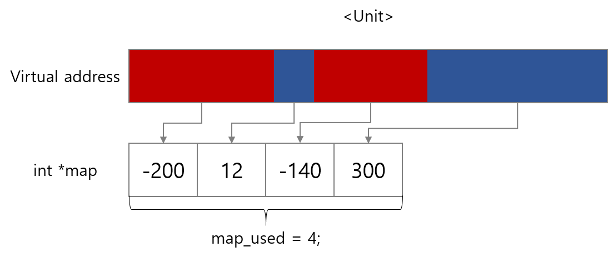
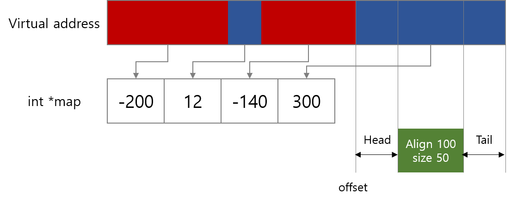

# Per CPU 분석 노트

Per-cpu 할당자는 "[percpu: implement new dynamic percpu allocator](https://github.com/iamroot16/linux/commit/fbf59bc9d74d1fb30b8e0630743aff2806eafcea#diff-5050eed868076fe2656aea8c2eb7312a)"의 패치로 크게 변경되었다. 또한 뒤따르는 후속 패치들로 2800줄에 이르게 되었다. 다양한 내용이 반영된 최신의 percpu.c 파일을 분석하기보다는 기본적인 Per-cpu 설계 방향을 이해하기 위해 앞서 얘기한 커밋을 살펴보자.

주목할 내용은 **Chunk**라는 새로운 자료구조와, **vmalloc**을 활용한다는 것이다. 먼저 Chunk 구조체를 들여다 보자.

```c
struct pcpu_chunk {
    /* 청크 검색을 위한 멤버 */
    struct list_head    list;       /* 연결 리스트로 청크를 관리하기 위함. */
    int         free_size;          /* 적합한 청크를 검색하기 위한 멤버. */
    int         contig_hint;        /* 할당할 공간이 있는지 위한 멤버. */
    
    struct rb_node      rb_node;    /* 주소에 대응하는 청크를 찾기 위한 멤버 */
    
    /* 청크 내부 메모리 관리를 위한 멤버 */
    struct vm_struct    *vm;        /* 청크에 대응하는 가상 주소를 저장 */
    int         map_used;           /* map의 length */
    int         map_alloc;          /* map에서 사용되고 있는 엔트리의 수 */
    int         *map;               /* 청크의 메모리를 관리하는 벡터 */
    struct page     *page[];        /* 가상 주소에 대응하는 물리 페이지 디스크립터 배열 */
}
```

## Chunk's internal memory management

먼저 청크 내부 메모리 관리를 위한 멤버에 대해 살펴보자. **vm**은 **get\_vm\_area**를 통해 청크에 할당된 가상 주소 영역이다. 해당 가상 주소 영역은 CPU 수 만큼 나누어, 각 CPU마다 고유한 영역을 가지도록 한다. 이를 **unit**이라고 한다.


 따라서, chunk에 per-cpu 변수를 할당한다는 말은 chunk 내의 각각의 유닛에 변수가 들어갈 공간을 마련한다는 말이다. 그렇기에 chunk는 유닛 내의 할당된 공간/사용 가능한 공간을 관리해야 한다. 이를 위해 **map**이 사용된다.

map은 unit 내의 할당 정보를 저장하고 있는 벡터이며, 할당된/할당되지 않은 연속된 주소에 대해 하나의 엔트리를 가진다. 할당된 영역은 음수로, 할당되지 않은 영역은 양수로 저장된다.



마지막으로 page는 가상 주소 영역에 할당&매핑된 물리 페이지 디스크립터 배열을 의미한다.

## Chunk searching

요청받은 크기의 per-cpu 변수를 할당하기 위해서는, 적당한 chunk를 찾아야한다. 단순하게 모든 chunk를 순회하면서 찾을 수 있지만, 효율적인 검색을 위해 **slot**을 도입했다.

```c
static struct list_head *pcpu_slot;     /* chunk list slots */

...

#define PCPU_SLOT_BASE_SHIFT        5   /* 1-31 shares the same slot */
```

 버디 할당자처럼, chunk의 free size에 따라 청크가 위치하는 슬롯이 다르다.



```c
static int pcpu_size_to_slot(int size)
{
    int highbit = fls(size);     /* ilog2(size) */
    
    /* size가 16미만일때(=high bit가 3이하일때), slot index는 1 */
    return max(highbit - PCPU_SLOT_BASE_SHIFT + 2, 1);
}
```



```c
static int pcpu_chunk_slot(const struct pcpu_chunk *chunk)
{
    if (chunk->free_size < sizeof(int) || chunk->contig_hint < sizeof(int))
        return 0;

    return pcpu_size_to_slot(chunk->free_size);
}
```




## Per-cpu Alloc/Free



```c
void *__alloc_percpu(size_t size, size_t align)
{
    void *ptr = NULL;
    struct pcpu_chunk *chunk;
    int slot, off;

    if (unlikely(!size || size > PAGE_SIZE << PCPU_MIN_UNIT_PAGES_SHIFT ||
             align > PAGE_SIZE)) {
        WARN(true, "illegal size (%zu) or align (%zu) for "
             "percpu allocation\n", size, align);
        return NULL;
    }

    mutex_lock(&pcpu_mutex);

    /* 후보 슬롯들에 대해 순회 */
    for (slot = pcpu_size_to_slot(size); slot < pcpu_nr_slots; slot++) {
        list_for_each_entry(chunk, &pcpu_slot[slot], list) {
            if (size > chunk->contig_hint)
                continue;
            off = pcpu_alloc_area(chunk, size, align);
            if (off >= 0)
                goto area_found;
            if (off != -ENOSPC)
                goto out_unlock;
        }
    }

    /* 새로운 청크 할당, 해당 청크에서 pcpu_alloc_area 호출
     *               내용 생략... 
     */
    
area_found:
    /* populate, map and clear the area */
    if (pcpu_populate_chunk(chunk, off, size)) {
        pcpu_free_area(chunk, off);
        goto out_unlock;
    }

    ptr = __addr_to_pcpu_ptr(chunk->vm->addr + off);
out_unlock:
    mutex_unlock(&pcpu_mutex);
    return ptr;
}
```



```c
static int pcpu_alloc_area(struct pcpu_chunk *chunk, int size, int align)
{
    int oslot = pcpu_chunk_slot(chunk);
    int max_contig = 0;
    int i, off;

    /*
     * The static chunk initially doesn't have map attached
     * because kmalloc wasn't available during init.  Give it one.
     */
    if (unlikely(!chunk->map)) {
        chunk->map = pcpu_realloc(NULL, 0,
                PCPU_DFL_MAP_ALLOC * sizeof(chunk->map[0]));
        if (!chunk->map)
            return -ENOMEM;

        chunk->map_alloc = PCPU_DFL_MAP_ALLOC;
        chunk->map[chunk->map_used++] = -pcpu_static_size;
        if (chunk->free_size)
            chunk->map[chunk->map_used++] = chunk->free_size;
    }

    for (i = 0, off = 0; i < chunk->map_used; off += abs(chunk->map[i++])) {
        bool is_last = i + 1 == chunk->map_used;
        int head, tail;

        /* extra for alignment requirement */
        head = ALIGN(off, align) - off;
        BUG_ON(i == 0 && head != 0);

        if (chunk->map[i] < 0)
            continue;
        if (chunk->map[i] < head + size) {
            max_contig = max(chunk->map[i], max_contig);
            continue;
        }

        /*
         * If head is small or the previous block is free,
         * merge'em.  Note that 'small' is defined as smaller
         * than sizeof(int), which is very small but isn't too
         * uncommon for percpu allocations.
         */
         if (head && (head < sizeof(int) || chunk->map[i - 1] > 0)) {
            if (chunk->map[i - 1] > 0)
                chunk->map[i - 1] += head;
            else {
                chunk->map[i - 1] -= head;
                chunk->free_size -= head;
            }
            chunk->map[i] -= head;
            off += head;
            head = 0;
        }

        /* if tail is small, just keep it around */
        tail = chunk->map[i] - head - size;
        if (tail < sizeof(int))
            tail = 0;

        /* split if warranted */
        if (head || tail) {
            if (pcpu_split_block(chunk, i, head, tail))
                return -ENOMEM;
            if (head) {
                i++;
                off += head;
                max_contig = max(chunk->map[i - 1], max_contig);
            }
            if (tail)
                max_contig = max(chunk->map[i + 1], max_contig);
        }

        /* update hint and mark allocated */
        if (is_last)
            chunk->contig_hint = max_contig; /* fully scanned */
        else
            chunk->contig_hint = max(chunk->contig_hint,
                         max_contig);

        chunk->free_size -= chunk->map[i];
        chunk->map[i] = -chunk->map[i];

        pcpu_chunk_relocate(chunk, oslot);
        return off;
    }
    /* 중략 */
}
```



```

```



* **Line 7~12**: size에 대한 유효성 검사를 한다.
* **Line 17**: size에 해당하는 슬롯부터 가장 큰 free size를 가지는 슬롯까지 순회한다.
* **Line 18**: 슬롯에 있는 연결 리스트를 순회한다.
* **Line 19~21:** 해당 chunk에 연속된 메모리가 존재한다면 pcpu\_alloc\_area를 호출한다.
  * pcpu\_alloc\_area 진입
  * **Line 11~21**: first chunk의 경우 map이 할당되지 않았기에 초기화 해주는 부분이다.
  * **Line 23**: map을 순회한다. i는 인덱스로, offset은 해당 segment가 시작하는 오프셋이다.
  * **Line 28:** 실제 할당받는 위치와 세그먼트의 오프셋의 차를 헤더에 저장한다. \(아래 그림 참조\)
  * **Line 31~35:**  해당 ****세그먼트가 할당 가능하고 충분한 크기를 가지는지 확인
  * **Line 44~46**: 헤드가 존재하고, 이전의 세그먼트가 할당 가능한 영역이라면 그 둘을 병합한다.
  * **Line 48~49**:  헤드가 충분히 작고, 이전의 세그먼트가 할당된 영역일때 둘을 병합한다.
  * **Line 51~53**: 헤드가 병합되었으므로, 현재 세그먼트에서 헤드만큼 크기를 낮추고, 오프셋도 헤드만큼 앞으로 늘린다.
  * **Line 57~58**: 테일을 구하고, 테일이 충분히 작은지 확인한다.
  * **Line 62~72**: 헤드나 테일이 있다면 새로운 엔트리가 삽입되야 한다. 따라서 pcpu\_split\_block을 호출한다. 새롭게 생성된 엔트리에 대해 max\_contig와 비교하고 갱신한다.
  * **Line 75~79**: max\_contig를 설정/갱신한다.
  * **Line 81~82**: 할당한 만큼 free\_size를 조절한다. 또한 할당된 영역을 음수로 표시한다.
  * **Line 84: free\_size**가 변경되었으므로, 들어갈 슬롯도 변경한다.
* **Line 35~43**: 찾은 offset에 대해 populate를 진행한다. 성공시 per-cpu 포인터를 리턴한다.



